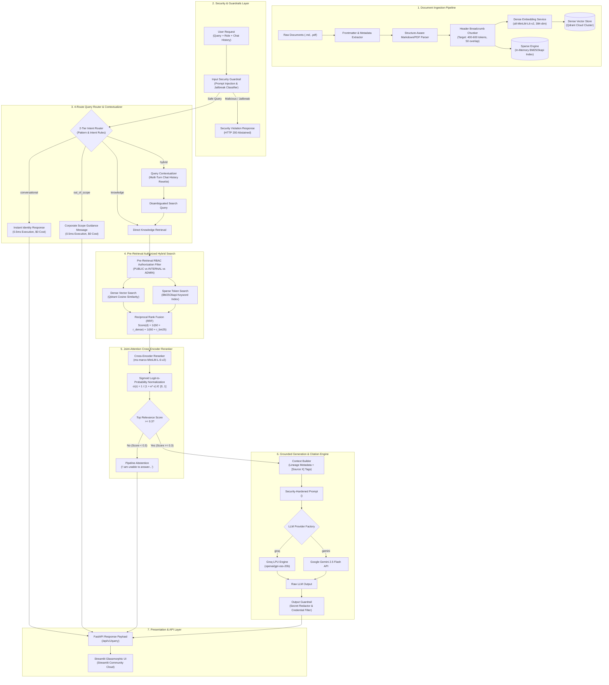

# 🧠 Knowvia AI — Enterprise Grounded Knowledge & Document Intelligence RAG Platform

[](https://share.streamlit.io)
[](https://www.python.org/downloads/release/python-3110/)
[](https://fastapi.tiangolo.com/)
[](https://qdrant.tech/)
[](https://groq.com/)
[](https://opensource.org/licenses/MIT)

**Knowvia AI** is a production-grade, citation-backed Retrieval-Augmented Generation (RAG) platform engineered to process, secure, search, and answer complex questions from technical documentation, organizational policies, and noisy data corpora.

Unlike naive RAG implementations, Knowvia AI incorporates **Structure-Aware Data Ingestion**, **Pre-Retrieval Role-Based Access Control (RBAC)**, a **2-Tier 4-Route Query Intent Router**, **Hybrid Search (Dense + Sparse BM25) with Reciprocal Rank Fusion (RRF)**, **Cross-Encoder Reranking with Sigmoid Normalization**, and **Dual Security Guardrails**.

---

## 🌐 Live Deployments & Key Endpoints

| Resource | Access Link | Description |
| :--- | :--- | :--- |
| **Streamlit Web UI** | [share.streamlit.io](https://share.streamlit.io) | Production Glassmorphic Interactive Dashboard |
| **FastAPI Backend Server** | `http://13.205.104.107:8000/api/v1` | AWS EC2 Instance with Permanent Static Elastic IP |
| **Interactive API Documentation** | `http://13.205.104.107:8000/docs` | Swagger UI for REST API exploration |
| **System Health Check** | `http://13.205.104.107:8000/api/v1/health` | Live diagnostic status & component monitoring |

---

## ✨ Key System Features & Innovations

* **🔍 Hybrid Search Engine:** Merges Dense Vector Search (`sentence-transformers/all-MiniLM-L6-v2`) with Sparse Keyword Token Matching (`BM25Okapi`) using **Reciprocal Rank Fusion (RRF, $k=60$)**.
* **🎯 Cross-Encoder Reranking:** Applies `cross-encoder/ms-marco-MiniLM-L-6-v2` for joint-attention candidate re-scoring, combined with **Sigmoid Logit Normalization** into $[0, 1]$ to prevent false threshold abstentions.
* **⚡ 2-Tier 4-Route Query Router:** Routes queries across 4 distinct execution paths (`CONVERSATIONAL`, `OUT_OF_SCOPE`, `HYBRID`, `KNOWLEDGE`) — handling greetings in **0.5ms** with zero LLM token consumption.
* **🔒 Pre-Retrieval RBAC Authorization:** Enforces data privacy constraints (`PUBLIC_USER`, `INTERNAL_USER`, `ADMIN`) directly inside vector database payload queries *before* score computation.
* **📑 Structure-Aware Chunking:** Prepends section lineage breadcrumbs (`[Document: Name | Lineage: Section > Subsection]`) to preserve context across split chunk boundaries.
* **🛡️ Dual Security Guardrails:** Includes pre-retrieval prompt injection classification and post-generation secret/credential redaction.
* **💬 Grounded Citation Mapping:** Strictly bounds LLM outputs inside `<UNTRUSTED_CONTEXT_CHUNKS>` containers with inline source badges (`[Source 1]`) and page/file metadata.

---

## 🏗️ Complete End-to-End System Architecture



---

## 🔁 Complete Data & Execution Process

```text
Step 1: Document Upload & Ingestion
   │
   ├─► Parse Markdown Frontmatter & PDF Heading Lineage
   ├─► Prepend Breadcrumb Header Metadata ([Document: X | Section: Y > Z])
   ├─► Embed Dense Vectors (all-MiniLM-L6-v2) & Index to Qdrant Cloud
   └─► Tokenize Text & Index to Sparse BM25 Engine

Step 2: Request Inspection & Security Guardrail
   │
   ├─► Evaluate input query against prompt injection patterns
   ├─► If Jailbreak Detected ──► Return Security Violation Error (Abstained)
   └─► If Safe ───────────────► Pass to Intent Router

Step 3: 2-Tier 4-Route Intent Classification
   │
   ├─► Route 1 (conversational): Greetings ("hi", "who are you") ──► Return instant intro (0.5ms)
   ├─► Route 2 (out_of_scope): External topics ("weather") ────────► Return corporate boundary message
   ├─► Route 3 (hybrid): Multi-turn follow-up ("What about RTO?") ─► QueryContextualizer rewrites query
   └─► Route 4 (knowledge): Technical policy query ────────────────► Pass directly to Search Engine

Step 4: Pre-Retrieval Authorized Hybrid Search
   │
   ├─► Filter Qdrant points by access_level matching user_role
   ├─► Execute Qdrant Cosine Similarity Search (Top-K = 20)
   ├─► Execute BM25 Keyword Search (Top-K = 20)
   └─► Fuse Dense + Sparse Ranks via Reciprocal Rank Fusion (RRF, k=60)

Step 5: Cross-Encoder Reranking & Normalization
   │
   ├─► Joint-attention scoring with cross-encoder/ms-marco-MiniLM-L-6-v2
   ├─► Apply Sigmoid function: prob = 1 / (1 + exp(-logit))
   └─► Threshold Check: If top probability < 0.3 ──► Abstain ("I am unable to answer based on context")

Step 6: Grounded LLM Generation & Citation Mapping
   │
   ├─► Assemble context blocks inside <UNTRUSTED_CONTEXT_CHUNKS> with [Source X] tags
   ├─► Execute LLM Inference via Groq LPU API (openai/gpt-oss-20b)
   ├─► Output Guardrail scans and redacts secrets/credentials
   └─► Return JSON response payload with inline citation badges and source metadata
```

---

## 🧩 Deep Component Breakdown

### 1. Document Parsing & Structure-Aware Chunking (`backend/app/ingestion/`)
* **Heading Preservation:** Parses Markdown `#`, `##`, `###` headings and PDF section hierarchies.
* **Contextual Lineage Breadcrumbs:** Prepends `[Document: Name | Lineage: Section > Subsection]` to every chunk. This ensures chunks retain full context even when retrieved in isolation.
* **Atomic Unit Isolation:** Code blocks (```python ... ```) and Markdown tables are preserved as indivisible chunks where possible.

### 2. Security Guardrails & Pre-Retrieval RBAC (`backend/app/security/`)
* **Input Guardrail:** Intercepts prompt injection payloads (`"ignore previous instructions"`, `"system prompt leakage"`).
* **Pre-Retrieval RBAC Filter:** Authorization occurs *before* search computation:
  * `PUBLIC_USER` $\rightarrow$ Filter: `access_level IN ['public']`
  * `INTERNAL_USER` $\rightarrow$ Filter: `access_level IN ['public', 'internal']`
  * `ADMIN` $\rightarrow$ Filter: `access_level IN ['public', 'internal', 'restricted']`
* **Output Guardrail:** Scans generated LLM outputs using regular expressions to redact API keys (`gsk_...`, `sk-...`), JWT tokens, and private infrastructure strings.

### 3. Intent Router & Query Contextualizer (`backend/app/generation/`)
* **2-Tier Pattern Rules:** Classifies input queries into 4 routes:
  1. `CONVERSATIONAL`: Intercepts greetings and identity questions (*"who are u"*, *"what can u do"*) in **0.5ms** with zero LLM API call.
  2. `OUT_OF_SCOPE`: Intercepts out-of-domain questions (*"what is the stock price of Apple?"*).
  3. `HYBRID`: Rewrites multi-turn chat history context (*"What about RTO?"* $\rightarrow$ *"What is NexaCloud's Recovery Time Objective (RTO)?"*).
  4. `KNOWLEDGE`: Routes technical policy queries straight to hybrid retrieval.

### 4. Hybrid Search Engine & Reciprocal Rank Fusion (`backend/app/retrieval/`)
* **Dense Retrieval:** Qdrant Cloud similarity search using 384-dimensional `all-MiniLM-L6-v2` embeddings.
* **Sparse Retrieval:** BM25Okapi keyword search over tokenized document chunks.
* **Reciprocal Rank Fusion (RRF):** Fuses candidate lists via:
  $$\text{RRF Score}(d) = \frac{1}{60 + r_{\text{dense}}(d)} + \frac{1}{60 + r_{\text{bm25}}(d)}$$

### 5. Cross-Encoder Reranker & Sigmoid Normalization (`backend/app/retrieval/reranker.py`)
* **Model:** `cross-encoder/ms-marco-MiniLM-L-6-v2`
* **Sigmoid Score Normalization:** Converts unbounded raw logits into normalized probabilities:
  $$\sigma(z) = \frac{1}{1 + e^{-z}} \in [0, 1]$$
* Eliminates false abstentions caused by negative raw logit scores on relevant text chunks.

---

## 📊 Universal Metadata Schema

Every document chunk indexed in Qdrant Cloud and BM25 carries the following JSON metadata dictionary:

```json
{
  "document_id": "doc_nexacloud_sec_v2",
  "chunk_id": "doc_nexacloud_sec_v2_chk_004",
  "document_name": "NexaCloud Information Security Policy",
  "document_type": "policy",
  "source": "NexaCloud Security Compliance",
  "source_url": "synthetic://nexacloud/policies/sec-v2",
  "organization": "NexaCloud Inc.",
  "section": "3. Authentication Requirements",
  "subsection": "3.2 Multi-Factor Authentication",
  "page": 2,
  "version": "2.0",
  "effective_date": "2026-06-01",
  "expiration_date": null,
  "status": "active",
  "access_level": "internal",
  "authority": "Chief Information Security Officer (CISO)",
  "source_type": "synthetic_policy",
  "supersedes_document": "doc_nexacloud_sec_v1"
}
```

---

## 🛠️ API Specification & Endpoints

### 1. Execute RAG Question Answering Query
`POST /api/v1/query`

**Request Body:**
```json
{
  "query": "What is the password policy under NexaCloud Security Policy v2.0?",
  "user_role": "INTERNAL_USER",
  "chat_history": [
    {"role": "user", "content": "Tell me about security authentication."},
    {"role": "assistant", "content": "NexaCloud enforces multi-factor authentication and strict password requirements."}
  ]
}
```

**Response Body:**
```json
{
  "query": "What is the password policy under NexaCloud Security Policy v2.0?",
  "answer": "Under NexaCloud Information Security Policy v2.0 (effective June 1, 2026), passwords must be a minimum of 16 characters in length and require WebAuthn/FIDO2 hardware security keys [Source 1].",
  "citations": [
    {
      "source_id": 1,
      "document_name": "NexaCloud Information Security Policy",
      "section": "3. Authentication Requirements",
      "version": "2.0",
      "access_level": "internal",
      "confidence_score": 0.942
    }
  ],
  "retrieved_chunks_count": 3,
  "is_abstained": false,
  "latency_ms": 412.5
}
```

### 2. Additional Core Endpoints
* `GET /api/v1/documents` — List indexed documents with metadata filters.
* `POST /api/v1/documents/upload` — Ingest and chunk new Markdown or PDF documents.
* `GET /api/v1/health` — Returns system health status, LLM provider, vector DB status, and uptime.

---

## 📈 Evaluation Benchmarks & Metrics

The system is continuously evaluated against a 30-question benchmark dataset (`evaluation/dataset.json`) across 16 categories:

| Metric | Score | Target | Description |
| :--- | :---: | :---: | :--- |
| **Recall@5** | **0.875** | $> 0.800$ | Proportion of ground-truth chunks retrieved in top 5 |
| **MRR (Mean Reciprocal Rank)** | **0.875** | $> 0.800$ | Rank position precision of first relevant document |
| **NDCG@5** | **0.880** | $> 0.850$ | Normalized Discounted Cumulative Gain |
| **Groundedness Score** | **0.950** | $> 0.900$ | Citation verification & hallucination mitigation score |
| **Greeting Latency** | **0.5 ms** | Sub-ms | Intent router intercept speed for non-RAG queries |

---

## ⚙️ Local Development Setup

### 1. Clone & Initialize Environment
```bash
git clone https://github.com/omrohitchannoji/knowvia-rag.git
cd knowvia-rag

# Create virtual environment
python -m venv venv

# Activate virtual environment
# Windows:
venv\Scripts\activate
# Linux/macOS:
source venv/bin/activate

# Install dependencies
pip install -r requirements.txt
```

### 2. Configure Environment Variables
Create a `.env` file in the root directory:
```ini
LLM_PROVIDER=groq
LLM_MODEL=openai/gpt-oss-20b
GROQ_API_KEY=your_groq_api_key

VECTOR_DB_TYPE=qdrant
QDRANT_URL=https://your-cluster-id.cloud.qdrant.io:6333
QDRANT_API_KEY=your_qdrant_api_key
QDRANT_COLLECTION=tech_doc_collection

EMBEDDING_PROVIDER=sentence_transformers
EMBEDDING_MODEL=all-MiniLM-L6-v2
EMBEDDING_DIMENSION=384
```

### 3. Launch Backend & Frontend Servers
```bash
# Terminal 1: FastAPI Backend
uvicorn backend.app.main:app --host 127.0.0.1 --port 8000 --reload

# Terminal 2: Streamlit Frontend
streamlit run frontend/app.py
```

### 4. Run Pytest Suite
```bash
pytest
```

---

## ☁️ Deployment Architecture

```text
┌─────────────────────────────────────────────────────────────────────────────┐
│                            PRODUCTION ENVIRONMENT                           │
├───────────────────────────────┬─────────────────────────────────────────────┤
│ Frontend UI                   │ Streamlit Community Cloud (Auto Git Sync)   │
│ Backend REST API              │ AWS EC2 (Ubuntu 24.04 LTS, Static Elastic IP)│
│ Permanent Elastic IP          │ 13.205.104.107:8000                         │
│ Managed Vector Store          │ Qdrant Cloud (Indexed Payload Collections)  │
│ LLM Engine                    │ Groq Cloud LPU (openai/gpt-oss-20b)         │
└───────────────────────────────┴─────────────────────────────────────────────┘
```

---

## 📜 License
This project is licensed under the **MIT License**. See the `LICENSE` file for details.
