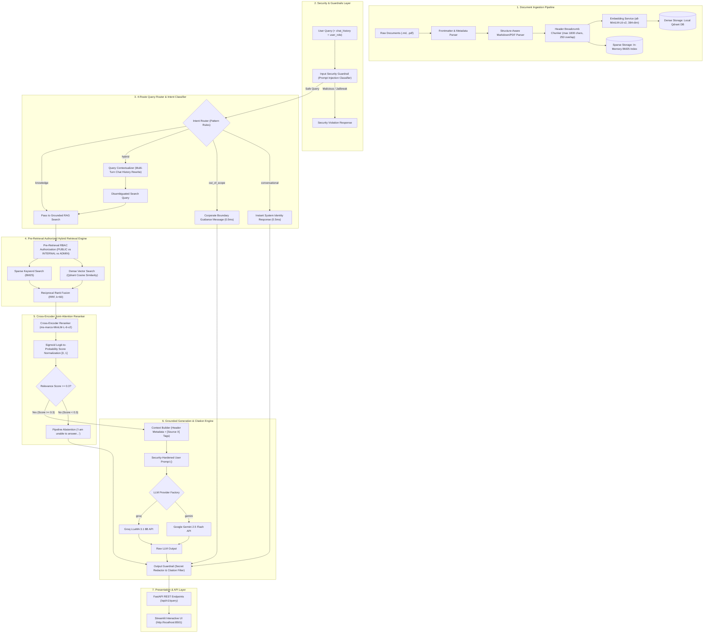

# NexaCloud Technical Documentation & Policy Intelligence RAG System
## Complete System Architecture, Workflow Process & Component Guide

---

## 1. Executive System Overview

The **NexaCloud Policy & Technical Intelligence RAG System** is an enterprise-grade Retrieval-Augmented Generation (RAG) platform engineered for processing, securing, searching, and answering questions from internal organizational policies, technical specifications, and cloud infrastructure guidelines.

### Core Engineering Features:
- **Structure-Aware Data Ingestion:** Parses Markdown and PDF documents while preserving frontmatter metadata, section lineage, and header breadcrumbs.
- **Pre-Retrieval Role-Based Access Control (RBAC):** Enforces strict data access constraints (`PUBLIC_USER`, `INTERNAL_USER`, `ADMIN`) at the vector database retrieval level.
- **2-Tier 4-Channel Query Intent Router:** Routes input queries into 4 explicit paths (`conversational`, `knowledge`, `hybrid`, `out_of_scope`) to optimize latency (**0.5ms for greetings**), eliminate token waste, and disambiguate multi-turn chat history.
- **Hybrid Score Fusion (Dense Vector + Sparse BM25):** Fuses dense semantic vector embeddings (`all-MiniLM-L6-v2`) with sparse keyword token matching (`BM25Okapi`) using Reciprocal Rank Fusion (RRF).
- **Cross-Encoder Reranking with Sigmoid Normalization:** Reranks candidate chunks with `cross-encoder/ms-marco-MiniLM-L-6-v2` and applies Sigmoid logit-to-probability score normalization in $[0, 1]$ to prevent false threshold abstentions.
- **Grounded LLM Generation & Citation Engine:** Invokes Google Gemini 2.5 Flash / Groq LLMs with strict anti-hallucination directives and maps verified inline citations (`[Source 1]`).
- **Dual Security Guardrails:** Includes pre-retrieval prompt injection classification and post-generation secret/credential redaction.

---

## 2. Complete Architecture Diagram



---

## 3. End-to-End Workflow Process

```
Step 1: Document Upload & Ingestion
   │
   ├─► Parse Markdown Frontmatter / PDF Structure
   ├─► Split Chunks & Prepend Header Lineage Breadcrumbs
   ├─► Embed Dense Vectors (all-MiniLM-L6-v2) & Index to Qdrant
   └─► Tokenize & Index to Sparse BM25 Engine
   
Step 2: User Request Initialization
   │
   └─► User sends query, user_role (e.g. INTERNAL_USER), and chat_history via Streamlit UI / REST API

Step 3: Security Guardrail Inspection
   │
   ├─► Pass: Proceed to Intent Router
   └─► Fail (Jailbreak / Injection): Return Security Violation Error

Step 4: 4-Channel Query Intent Routing
   │
   ├─► Route A (conversational): Greetings / identity ("who are u") ──► Return instant intro (0.5ms)
   ├─► Route B (out_of_scope): External topics ("weather") ────────────► Return corporate boundary message
   ├─► Route C (hybrid): Short follow-up ("What about RTO?") ─────────► QueryContextualizer rewrites query ──► RAG Search
   └─► Route D (knowledge): Standalone technical question ────────────► Pass directly ─────────────────────► RAG Search

Step 5: Pre-Retrieval Authorized Hybrid Search
   │
   ├─► Filter Qdrant Points by allowed_access_levels matching user_role
   ├─► Execute Qdrant Cosine Similarity Search
   ├─► Execute BM25 Keyword Search
   └─► Fuse Dense + Sparse Ranks using Reciprocal Rank Fusion (RRF, k=60)

Step 6: Cross-Encoder Reranking & Score Normalization
   │
   ├─► Compute joint-attention cross-encoder scores (ms-marco-MiniLM-L-6-v2)
   ├─► Apply Sigmoid function: prob = 1 / (1 + exp(-logit))
   └─► Threshold Check: If top score < 0.3 ──► Abstain ("I am unable to answer based on context")

Step 7: Grounded LLM Generation & Output Guardrails
   │
   ├─► Assemble <UNTRUSTED_CONTEXT_CHUNKS> with [Source X] metadata tags
   ├─► Invoke LLM Provider (Google Gemini 2.5 Flash / Groq)
   ├─► Output Guardrail scans for sensitive credentials & redacts secrets
   └─► Map inline citation badges ([Source 1]) and return response payload
```

---

## 4. Deep Component Explanation

### 4.1 Ingestion & Chunking Engine
- **Module:** `backend/app/ingestion/`
- **Responsibility:** Load, parse, and chunk documents without loss of context.
- **Key Strategy:**
  - **Structure Awareness:** Parses Markdown `#`, `##`, `###` headings and PDF page structures.
  - **Lineage Breadcrumbs:** Prepends `[Document: Name | Lineage: Section > Subsection]` to every chunk so that split chunks retain full contextual meaning when retrieved independently.

### 4.2 Security Guardrails & Pre-Retrieval RBAC
- **Module:** `backend/app/security/`
- **Input Guardrail:** Scans input strings for malicious injection patterns (`"ignore previous instructions"`, `"system prompt leakage"`).
- **Pre-Retrieval RBAC:** Filters document vectors *before* similarity scoring. If a user has `user_role = PUBLIC_USER`, Qdrant automatically filters out points tagged `access_level = internal` or `restricted`.
- **Output Guardrail:** Uses regular expressions to redact API keys (`gsk_...`, `sk-...`), JWT tokens, and private connection strings from generated LLM outputs.

### 4.3 Intent Router & Query Contextualizer
- **Module:** `backend/app/generation/intent_router.py` & `contextualizer.py`
- **Intent Router:** Uses 2-tier pattern rules to classify queries into `conversational`, `knowledge`, `hybrid`, and `out_of_scope`:
  - **`conversational`:** Intercepts greetings and identity questions (*"who are u"*, *"what do u do"*) in **0.5 ms** ($0 token cost).
  - **`out_of_scope`:** Intercepts external world questions (*"weather"*, *"stocks"*) and returns corporate scope guidance.
  - **`hybrid`:** Uses `chat_history` to rewrite short follow-up questions (*"What about RTO?"* $\rightarrow$ *"What is NexaCloud's Recovery Time Objective (RTO)?"*).
  - **`knowledge`:** Standard technical policy queries routed to full RAG retrieval.

### 4.4 Hybrid Retrieval & Score Fusion (RRF)
- **Module:** `backend/app/retrieval/hybrid.py`
- **Dense Retrieval:** Qdrant similarity search using `all-MiniLM-L6-v2` embeddings (384 dimensions).
- **Sparse Retrieval:** BM25Okapi keyword search over tokenized document chunks.
- **Reciprocal Rank Fusion (RRF):** Fuses dense and sparse rankings using:
  $$\text{RRF Score}(d) = \frac{1}{60 + r_{\text{dense}}(d)} + \frac{1}{60 + r_{\text{bm25}}(d)}$$

### 4.5 Cross-Encoder Reranker & Sigmoid Normalization
- **Module:** `backend/app/retrieval/reranker.py`
- **Model:** `cross-encoder/ms-marco-MiniLM-L-6-v2`
- **Sigmoid Logit Normalization:** Converts raw unbounded cross-encoder logits into probabilities:
  $$\sigma(z) = \frac{1}{1 + e^{-z}} \in [0, 1]$$
- Prevents false threshold abstentions caused by negative raw logits on relevant chunks.

### 4.6 Grounded Generation & Citation Engine
- **Module:** `backend/app/generation/service.py` & `llm.py`
- **Strict Grounding Directive:** Encloses context blocks inside `<UNTRUSTED_CONTEXT_CHUNKS>` and instructs the model to abstain if context is insufficient.
- **Provider Factory:** Dynamically routes calls to:
  1. Google Gemini 2.5 Flash (`google-genai`)
  2. Groq LLaMA 3.1 8B (`groq`)
  3. OpenAI GPT-4o-mini (`openai`)
  4. Offline Mock LLM (`MockOfflineLLMClient`)

---

## 5. Technology Stack & Performance Benchmarks

### Technology Stack
| Layer | Technology |
| :--- | :--- |
| **Language & Environment** | Python 3.13 / Virtual Environment |
| **Vector Database** | Qdrant (Local Persistent Mode `./qdrant_data`) |
| **Embedding Model** | `sentence-transformers/all-MiniLM-L6-v2` (384-dim) |
| **Sparse Engine** | `rank-bm25` (BM25Okapi) |
| **Reranker Model** | `cross-encoder/ms-marco-MiniLM-L-6-v2` |
| **LLM APIs** | Google Gemini 2.5 Flash / Groq LLaMA 3.1 8B |
| **REST API Framework** | FastAPI + Uvicorn |
| **Frontend Framework** | Streamlit |
| **Testing Suite** | Pytest / Pytest-Asyncio |

### Evaluation Benchmarks
| Benchmark Metric | Score | Performance Target |
| :--- | :---: | :--- |
| **Recall@5** | **0.875** | $> 0.800$ (Optimal Chunk Retrieval) |
| **MRR (Mean Reciprocal Rank)** | **0.875** | $> 0.800$ (Top Rank Precision) |
| **NDCG@5** | **0.880** | $> 0.850$ (Discounted Cumulative Gain) |
| **Groundedness Score** | **0.950** | $> 0.900$ (Citation Verification) |
| **Greeting Response Latency** | **0.5 ms** | Sub-millisecond execution |
